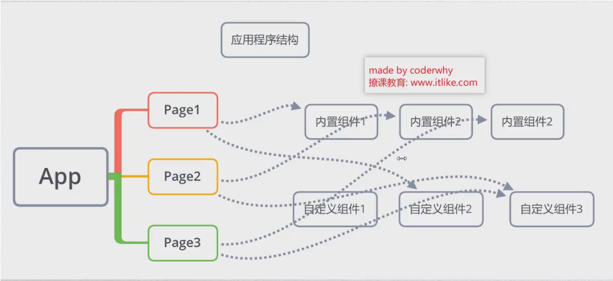
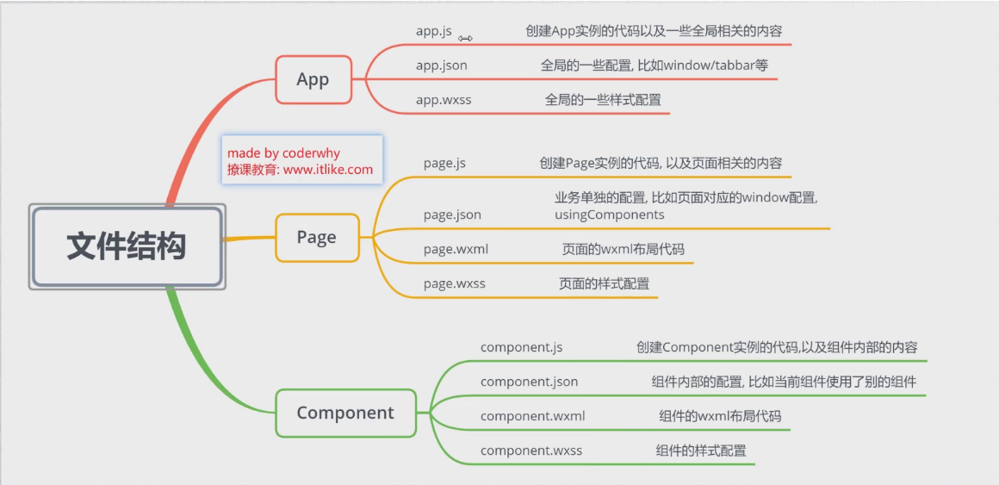
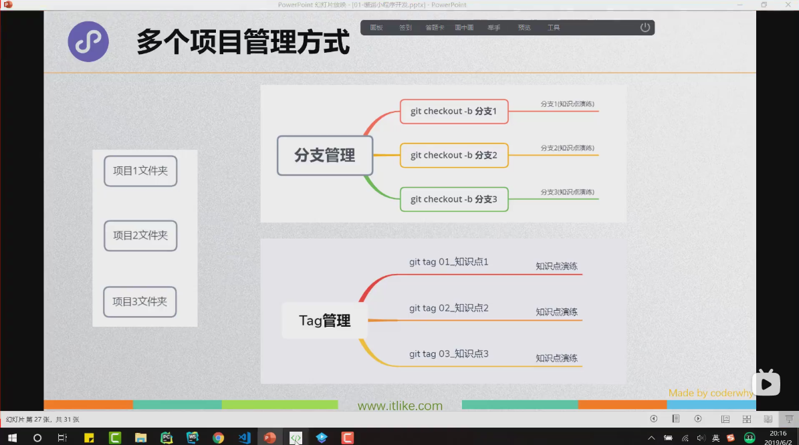
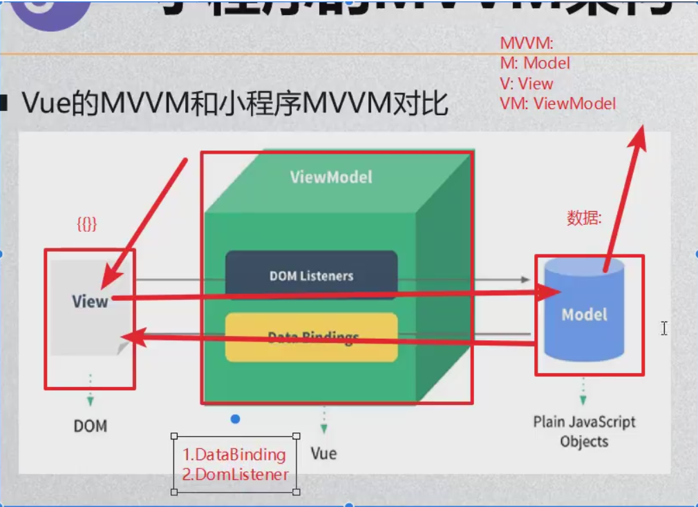
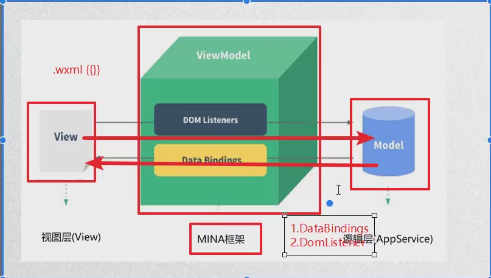

# 学习线路和课程大纲

* 一、邂逅小程序
* 二、你好，小程序
* 三、小程序架构
* 四、常见内置组件
* 五、WXSS&WXML&WXS
* 六、事件处理
* 七、自定义组件
* 八、系统API学习
* 九、发布&性能优化
* 十、项目开发实战

# 阶段一大纲

* 一、认识小程序开发
* 二、小程序诞生背景
* 三、开发前准备工作
* 四、小程序目录结构
* 五、从零搭建项目
* 六、项目git管理
* 七、小程序初体验
* 八、命令式和生命式

# 什么是小程序

* 官方解释：微信小程序是一种全新的连接用户和服务的方式，它可以在微信内被便捷的获取和传播，同时具有出色的使用体验。
* 我的解释：小程序是微信生态的一部分，它提供了一种更加 **方便和高效** 的用户交互方式

# 小程序的出现到底带来了什么呢？

* 1. 用户使用的便捷性

  * 普通的app我们需要的使用过程：了解app - 下载 - 打开 - 注册 - 使用
  * 小程序版本的app的使用过程：了解app - 打开（扫码/搜索) - 使用

* 2 远好于公众号和h5页面的体验

  * 比如寄顺丰快递，使用公众号和小程序的体验差异非常大

* 3 释放手机内存空间

  * 对于手机空间不大的人来说，安装很多app会带来灾难，经常面临空间不足；
    * 小程序不需要安装，而且又规定的大小（目前不能超过8M，包括在使用分包的情况下）；

* 4 让手机桌面更加简洁

  * 不需要下载app，就不需要花时间来管理自己的app了；

# 小程序开发的必要性

* 由于小程序各种好处，使用小程序的**用户会越来越多**
* 那么从公司角度，有自己的小程序就变得非常有必要
* 一方面，为了给用户带来更加便捷的使用体验，需要开发对应的一款小程序：
  * 开发出来的小程序，用户体验优于h5的体验，并且底层可以调用原生的各种接口；
  * 而且可以做到：一端开发，多端运行（ios端，android端）
* 另一方面，必须抢占小程序的市场：
  * 你不开发，你竞争对手也会开发，当大量用户为了使用方便涌入你的竞争对手时，你就来不及了
* 所以现在公司经常出现，让前端或客户端程序员，甚至是服务端程序员去帮公司做一个小程序。
* 前面我们从**市场层面**探讨了小程序的特点
* 作为开发者，我们再从**技术的角度**探讨小程序的特点

# WebView的发展和不足

* WebView的飞速发展：
  * 随着公众号的出现和繁荣，WebView的使用频率越来越高，不少的企业或个人都需要做H5页面。
  * H5页面的劣势很明显：**体验太渣**，而且**无法调用很多底层App拥有的功能**
  * 微信团队也因此提供了一些js-sdk给Web开发者使用，包括拍照、音频、地图、支付、分享等能力。
  * 但是依然没法改变体验很渣这一点（比如加载某个页面经常是白屏、交互无反馈、页面切换生硬等）

# Native的优势和劣势

* 很长一段时间，我们认为解决这种白屏、交互体验差、页面切换生硬这种问题，都必须靠**原生**,或者类似于Weex、Reac Native这种开发方式，最终呈现出接近原生应用
* 但是Native也有它的很多的弊端
  * **开发门槛高**、**多段开发**或者**适配**、版本**更新需要审核**、**版本迭代慢**
* 我们希望综合他们各自的优势，出现一种新的解决方案：
  * 开发门槛：
    * Native：高
    * Web：低
    * 期望：低
  * 体验：
    * Native：好
    * Web：白屏、交互反馈差
    * 期望：接近原生体验
  * 版本更新：
    * Native：需审核、迭代慢
    * Web：在线更新
    * 期望：在线更新
  * 管控性：
    * Native：平台可管控
    * Web：难管控
    * 期望：可管控

# 小程序的诞生

* 我们知道，任何新的技术或者模式的产生，都是为了解决行业的痛点：小程序就是在这样的背景下诞生的
* 小程序正是大家期盼已久的产物，它有什么特点呢：
  * **类似于Web 开发模式，入门的门槛低**：基本上是类似于html+css+js；
  * **可直接云端更新**：微信审核，无需经过app store等平台；
  * **提升用户体验**：通过提供基础能力，原生组件结合等方式，提升用户体验；
  * **平台管控能力**：小程序提供云端更新，通过代码上传、审核等方式，增强对开发者的管控能力；
  * **双线程模型**：逻辑层和渲染层分开加载，提高了管控性和安全性（沙盒环境运行js代码，不允许执行任何和浏览器相关的接口，比如跳转页面、操作dom等）；
* 目前小程序已经在用户和开发者中普及起来，并且依附于微信平台大量的人群基数，正在快速的发展

# 小程序的历史

* 2016年9月21日发布的小程序内测版
* 2017年1月9日正式上线 
* https://developers.weixin.qq.com/miniprogram/dev/framework/release/
* 截至目前，小程序的技术和生态都相对非常成熟，完全是学习小程序的好时机。
* 那么，学习小程序需要哪些预备知识呢？

# 小程序预备知识

* 小程序的开发主要分成三部分：
  * **页面布局**： WXML，类似于html开发
  * **页面样式**：WXSS，几乎就是CSS（某些不支持，某些进行了增强）
  * **页面脚本**：JavaScript+wxs，（js，以及WeixinScript后续学习）
* 也就是学习微信小程序还是需要大家具备**基本的前端知识**
  * 如果使用过一些**MVVM架构的框架**（vue,react），那么更有利于对它的学习。

​	

* 前端开发者：直接学习即可。
* 客户端、服务端开发者（iOS，android，pc，wp？）：先学习html+css+js的基础知识会更好一些（并非绝对，学习能力强的可以一边学习，一边补充）
* 编程零基础：不适合

# 开发前准备工作

* 申请个appid
* 下载开发工具

## 注册账号-申请appid

* 登录微信公众平台：https://mp.weixin.qq.com/
  * 一个账号对应一个小程序；
  * 企业政府媒体其他组织主题可以注册50个小程序；
  * 个体户和个人类型主体可注册5个小程序；

## 小程序开发工具

* 开发工具的选择：官方微信Web开发者工具、VScode

## 应用程序的结构

* 小程序结构划分：最上层App -> 多个Page -> 多个组件
* 
* 
* 

# 知识点组织方法

* git add .
* git commit -m '知识点1'
* git tag tag1 // 知识点1打tag标记
* git log
* git reset --hard  log里面的id前面几位 // 初始化
* git tag tag2 // 知识点2打tag2标记
* ……
* git push --tags

## 使用的时候

* git checkout tag1  // 转向tag1的知识点
* git checkout tag2  // 转向tag2的知识点

# 小程序初体验

* 数据绑定
* 列表渲染
* 事件监听

# 小程序的MVVM架构

## Vue的MVVM和小程序MVVM对比

## 编程范式

* 1.命令式编程：原生操作DOM
* 2.生命式编程：Vue/React/Angular