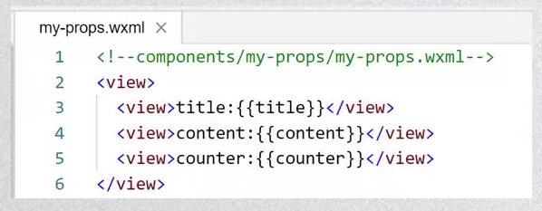
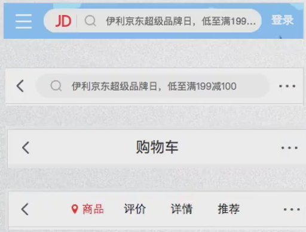
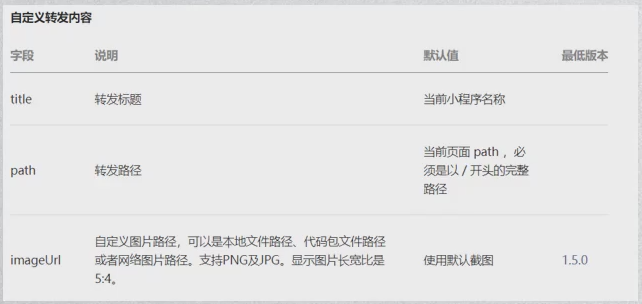

# 学习线路和课程大纲

* 一、邂逅小程序
* 二、你好，小程序
* 三、小程序架构
* 四、常见内置组件
* 五、WXSS&WXML&WXS
* 六、事件处理
* 七、自定义组件
* 八、系统API学习
* 九、发布&性能优化
* 十、项目开发实战

# 阶段一大纲

* 一、认识小程序开发
* 二、小程序诞生背景
* 三、开发前准备工作
* 四、小程序目录结构
* 五、从零搭建项目
* 六、项目git管理
* 七、小程序初体验
* 八、命令式和生命式

# 什么是小程序

* 官方解释：微信小程序是一种全新的连接用户和服务的方式，它可以在微信内被便捷的获取和传播，同时具有出色的使用体验。
* 我的解释：小程序是微信生态的一部分，它提供了一种更加 **方便和高效** 的用户交互方式

# 小程序的出现到底带来了什么呢？

* 1. 用户使用的便捷性

  * 普通的app我们需要的使用过程：了解app - 下载 - 打开 - 注册 - 使用
  * 小程序版本的app的使用过程：了解app - 打开（扫码/搜索) - 使用

* 2 远好于公众号和h5页面的体验

  * 比如寄顺丰快递，使用公众号和小程序的体验差异非常大

* 3 释放手机内存空间

  * 对于手机空间不大的人来说，安装很多app会带来灾难，经常面临空间不足；
    * 小程序不需要安装，而且又规定的大小（目前不能超过8M，包括在使用分包的情况下）；

* 4 让手机桌面更加简洁

  * 不需要下载app，就不需要花时间来管理自己的app了；

# 小程序开发的必要性

* 由于小程序各种好处，使用小程序的**用户会越来越多**
* 那么从公司角度，有自己的小程序就变得非常有必要
* 一方面，为了给用户带来更加便捷的使用体验，需要开发对应的一款小程序：
  * 开发出来的小程序，用户体验优于h5的体验，并且底层可以调用原生的各种接口；
  * 而且可以做到：一端开发，多端运行（ios端，android端）
* 另一方面，必须抢占小程序的市场：
  * 你不开发，你竞争对手也会开发，当大量用户为了使用方便涌入你的竞争对手时，你就来不及了
* 所以现在公司经常出现，让前端或客户端程序员，甚至是服务端程序员去帮公司做一个小程序。
* 前面我们从**市场层面**探讨了小程序的特点
* 作为开发者，我们再从**技术的角度**探讨小程序的特点

# WebView的发展和不足

* WebView的飞速发展：
  * 随着公众号的出现和繁荣，WebView的使用频率越来越高，不少的企业或个人都需要做H5页面。
  * H5页面的劣势很明显：**体验太渣**，而且**无法调用很多底层App拥有的功能**
  * 微信团队也因此提供了一些js-sdk给Web开发者使用，包括拍照、音频、地图、支付、分享等能力。
  * 但是依然没法改变体验很渣这一点（比如加载某个页面经常是白屏、交互无反馈、页面切换生硬等）

# Native的优势和劣势

* 很长一段时间，我们认为解决这种白屏、交互体验差、页面切换生硬这种问题，都必须靠**原生**,或者类似于Weex、Reac Native这种开发方式，最终呈现出接近原生应用
* 但是Native也有它的很多的弊端
  * **开发门槛高**、**多段开发**或者**适配**、版本**更新需要审核**、**版本迭代慢**
* 我们希望综合他们各自的优势，出现一种新的解决方案：
  * 开发门槛：
    * Native：高
    * Web：低
    * 期望：低
  * 体验：
    * Native：好
    * Web：白屏、交互反馈差
    * 期望：接近原生体验
  * 版本更新：
    * Native：需审核、迭代慢
    * Web：在线更新
    * 期望：在线更新
  * 管控性：
    * Native：平台可管控
    * Web：难管控
    * 期望：可管控

# 小程序的诞生

* 我们知道，任何新的技术或者模式的产生，都是为了解决行业的痛点：小程序就是在这样的背景下诞生的
* 小程序正是大家期盼已久的产物，它有什么特点呢：
  * **类似于Web 开发模式，入门的门槛低**：基本上是类似于html+css+js；
  * **可直接云端更新**：微信审核，无需经过app store等平台；
  * **提升用户体验**：通过提供基础能力，原生组件结合等方式，提升用户体验；
  * **平台管控能力**：小程序提供云端更新，通过代码上传、审核等方式，增强对开发者的管控能力；
  * **双线程模型**：逻辑层和渲染层分开加载，提高了管控性和安全性（沙盒环境运行js代码，不允许执行任何和浏览器相关的接口，比如跳转页面、操作dom等）；
* 目前小程序已经在用户和开发者中普及起来，并且依附于微信平台大量的人群基数，正在快速的发展

# 小程序的历史

* 2016年9月21日发布的小程序内测版
* 2017年1月9日正式上线 
* https://developers.weixin.qq.com/miniprogram/dev/framework/release/
* 截至目前，小程序的技术和生态都相对非常成熟，完全是学习小程序的好时机。
* 那么，学习小程序需要哪些预备知识呢？

# 小程序预备知识

* 小程序的开发主要分成三部分：
  * **页面布局**： WXML，类似于html开发
  * **页面样式**：WXSS，几乎就是CSS（某些不支持，某些进行了增强）
  * **页面脚本**：JavaScript+wxs，（js，以及WeixinScript后续学习）
* 也就是学习微信小程序还是需要大家具备**基本的前端知识**
  * 如果使用过一些**MVVM架构的框架**（vue,react），那么更有利于对它的学习。


​	

* 前端开发者：直接学习即可。
* 客户端、服务端开发者（iOS，android，pc，wp？）：先学习html+css+js的基础知识会更好一些（并非绝对，学习能力强的可以一边学习，一边补充）
* 编程零基础：不适合


# 开发前准备工作

* 申请个appid
* 下载开发工具

## 注册账号-申请appid

* 登录微信公众平台：https://mp.weixin.qq.com/
  * 一个账号对应一个小程序；
  * 企业政府媒体其他组织主题可以注册50个小程序；
  * 个体户和个人类型主体可注册5个小程序；

## 小程序开发工具

* 开发工具的选择：官方微信Web开发者工具、VScode

## 应用程序的结构

* 小程序结构划分：最上层App -> 多个Page -> 多个组件
* 
* 
* 

# 知识点组织方法

* git add .
* git commit -m '知识点1'
* git tag tag1 // 知识点1打tag标记
* git log
* git reset --hard  log里面的id前面几位 // 初始化
* git tag tag2 // 知识点2打tag2标记
* ……
* git push --tags

## 使用的时候

* git checkout tag1  // 转向tag1的知识点
* git checkout tag2  // 转向tag2的知识点


# 小程序初体验

* 数据绑定
* 列表渲染
* 事件监听

# 小程序的MVVM架构

## Vue的MVVM和小程序MVVM对比


## 编程范式

* 1.命令式编程：原生操作DOM
* 2.生命式编程：Vue/React/Angular

# 小程序的配置和架构

## 配置小程序

* 小程序的很多**开发需求**被规定在了**配置文件**中。
* 为什么这样做呢？
  * 这样做可以更有利于我们的**开发效率**；
  * 并且可以保证开发出来的小程序的某些**风格是比较一致**的；
  * 比如导航栏-顶部TabBar，以及页面路由等等。
* 常见的配置文件有哪些呢？
  * project.config.json: 项目配置文件，比如项目名称、appid等；
    * https://developers.weixin.qq.com/miniprogram/dev/devtools/projectconfig.html
  * sitemap.json: 小程序搜索相关的；
    * https://developers.weixin.qq.com/miniprogram/dev/framework/sitemap.html
  * app.json: 全局配置；
  * page.json: 页面配置；

## 全局配置

* 全局配置比较多，我们这里将几个比较重要的。完整的查看官方文档。

  * https://developers.weixin.qq.com/miniprogram/dev/reference/configuration/app.html
  * **pages**：类型：string[]；必填：是；描述：页面路径列表
  * **window**：类型：Object；必填：否；描述：全局的默认窗口表现
  * **tabBar**：类型：Object；必填：否；描述：底部tab栏的表现
  * pages:页面路径列表
    * 用于指定小程序由**哪些页面组成**，每一项都对应一个页面的**路径信息**。
    * 小程序中**所有的页面都是必须在pages中进行注册**的。
  * window：全局的默认窗口展示
    * 用户指定窗口如何展示，其中还包含了很多其他的属性
  * tabBar：底部tab栏的展示
    * 具体属性稍后我们进行演示

* 我们来做如下的效果：

   

## 页面配置

直接配置，不需要放到window对象里

# 小程序的双线程模型

* 谁是小程序的宿主环境呢？**微信客户端**

  * **宿主环境**为了执行小程序的各种文件：wxml、wxss文件、js文件
  * 提供了小程序的**双线程模型**

  

* **双线程模型**：

  * **WXML模块和WXSS**样式运行于**渲染层**，渲染层使用**WebView线程渲染**（一个程序有多个页面，会使用多个WebView的线程）。
  * **JS脚本**（app.js/home.js等）运行于**逻辑层**，逻辑层使用JsCore运行js脚本。
  * 这两个线程都会经由微信客户端（Native）进行中转交互。

* 下面我们探讨一下如何通过这两个线程**渲染出了界面**。

## 界面渲染过程-wxml和DOM树

* 首先，我们需要知道，wxml等价于一棵DOM树，也可以使用一个js对象来模拟（虚拟DOM）


## 界面渲染过程-初始化渲染

* 那么，WXML可以先转成js对象，再渲染出真正的DOM树


## 界面渲染过程 - 数据发生变化

* 通过setData把msg数据从 ”hello World“ 变成 ”Goodbye“

  * 产生的**js对象**对应的节点就会发生变化
  * 此时可以**对比前后两个js对象**得到变化的部分
  * 然后把这个**差异**应用到原来的Dom树上
  * 从而达到更新UI的目的，这就是”**数据驱动**“的原理

  

## 界面渲染的整体流程

* 界面渲染整体流程：
  * 1.在渲染层，宿主环境会把**WXML**转化成对应的**JS对象**；
  * 2.将**JS对象**再次转成**真实DOM树**，交由渲染层线程渲染；
  * 3.数据变化时，逻辑层提供最新的变化数据，js对象发生变化比较进行diff算法对比；
  * 4.将最新变化的内容反映到真实的DOM树中，更新UI；

# 注册小程序

## 小程序的启动流程


## 注册小程序 - 参数解析

* 每个小程序都需要在app.js中调用App方法**注册小程序实例**
  * 在注册时，可以绑定对应的生命周期函数，在生命周期函数中，执行对应的代码。
  * https://developers.weixin.qq.com/miniprogram/dev/reference/api/App.html
  * 常用的生命周期函数：
    * onLaunch：小程序初始化完成时
    * onShow：小程序显示出来时
    * onHide：小程序隐藏时
    * onError：小程序产生一些错误

## 注册App时做什么呢？

* 我们来思考：注册App时，我们一般会做什么呢？
  * 1.判断小程序的**进入场景**
  * 2.监听**生命周期函数**，在生命周期中执行对应的业务逻辑，比如在某个生命周期函数中获取微信用户的信息。
  * 3.因为App()实例只有一个，并且是**全局共享**的（单例对象），所以我们可以将一些共享数据放在这里。
* **小程序后台存活时间：**
  * https://developers.weixin.qq.com/miniprogram/dev/framework/operating-mechanism.html
* **小程序的打开场景较多**：
  * 常见的打开场景：群聊会话中打开、小程序列表中打开、微信扫一扫打开、另一个小程序打开
  * https://developers.weixin.qq.com/miniprogram/dev/reference/scene-list.html
* **如何确定场景？**
  * 在onLaunch和onShow生命周期回调函数中，会有options参数，其中有scene值

### 获取用户信息 - 保存全局变量

* 获取微信用户的基本信息的方式：
  * 1.wx.getUserInfo - 即将废弃的接口；
  * 2.button组件 - 将open-type改成getUserInfo，并且绑定bindgetuserinfo事件去获取；
  * 3.使用open-data组件展示用户信息；
* 保存全局变量：

## 注册页面

* 小程序中的每个页面，都有一个对应的js文件，其中调用page方法**注册页面示例**
  * 在注册时，可以绑定初始化数据、生命周期回调、事件处理函数等。
  * https://developers.weixin.qq.com/miniprogram/dev/reference/api/Page.html

### 注册Page时做什么呢？

* **我们来思考**：注册一个Page页面时，我们一般需要做什么呢？

  * 1.在**生命周期函数**中发送网络请求，从服务器获取数据；
  * 2.**初始化一些数据**，以方便被wxml引用展示；
  * 3.**监听wxml中的事件**，绑定对应的事件函数；
  * 4.其他一些**监听**（比如页面滚动、上拉刷新、下拉加载更多等）；

  

* 网络请求和其他一些事件的监听，放到后续再来使用


# page实例生命周期：

* 

# 内置组件

## Text组件

* Text组件用于显示文本，类似于span标签，是行内元素


* **selectable属性**决定文本内容是否可以让用户选中
* **space属性**有三个取值（见右图）
* **decode属性**是否解码
  * decode可以解析的有\&nbsp; \&lt; \&gt; \&amp; \&apos; \&ensp; \&emsp;

## button组件

* Button组件用于创建按钮，默认块级元素
* 常见属性：


### open-type的取值

* opent-type用户获取一些特殊性的权限，可以绑定一些特殊的事件：
* 

## view组件

* 视图组件（块级元素，独占一行，通常用作容器组件）


* 常用属性：


## image组件

* image组件用于显示图片，有如下常见属性：


* 其中src可以是本地图片，也可以是网络图片
* Mode属性使用也非常关键，详情查看官网：
  * https://developers.weixin.qq.com/miniprogram/dev/component/image.html

## input组件

* input组件用于接收用户的输入信息，也是开发中非常常见的，有如下属性：


## scroll-view组件

* scroll-view可以实现局部滚动，常见属性如下：
  * scroll-x，scroll-y，bindscroll，等

## 共同属性


# wxml&wxss&wxs

## 页面样式写法

* 页面样式的三种写法
  * 行内样式、页面样式、全局样式
  * 三种样式都可以作用于页面的组件
* 如果有相同的样式
  * 优先级一次是：行内样式＞页面样式＞全局样式


## 支持的选择器


* 选择器的权重：


## wxss的扩展 - 单位尺寸

* 尺寸单位

  * **rpx（responsive pixel）：**可以根据屏幕宽度进行自适应。规定屏幕宽为750rpx。
  * 如在iPhone6 上，屏幕宽度为375px，共有750个物理像素，则750rpx = 375px = 750物理像素，1rpx = 0.5px = 1物理像素。

  

* **建议**   开发微信小程序时设计师可以用**iPhone6** 作为视觉稿的标准。

## wxss的扩展 - 样式导入

* **为什么使用样式导入**？
  * 在某些情况下，我们可能会**将样式分在多个wxss文件**中，方便对样式的管理。
  * 这个时候，我们就可以使用样式导入，来让单独的wxss生效
* **我们可以在一个wxss中导入另一个wxss文件：**
  * 1.使用**@import**进行导入
  * 2.@import后跟需要导入的外联样式表的相对路径（或者绝对路径也可以），用；表示语句结束。
* **导入的位置在哪里**？
  * 可以在app.wxss中导入这个样式
  * 也可以在page.wxss导入这个样式


## 官方样式库

* 为了减少开发者样式开发的工作量，小程序官方提供了**WeUI.wxss基本样式库**
* https://github.com/Tencent/weui-wxss


## Mustache语法

* WXML基本格式：
  * **类似于HTML代码：**比如可以写成单标签，也可以写成双标签
  * **必须有严格的闭合：**没有闭合会导致编译错误
  * **大小写敏感：**class和Class是不同的属性

### 逻辑判断wx:if - wx:elif - wx:else

* 某些时候，我们需要根据条件来决定一些内容是否渲染：

  * 当条件为true时，view组件会渲染出来
  * 当条件为false时，view组件不会渲染出来

  

* 根据按钮点击，决定是否渲染：


* 也可以有多个条件：


### 逻辑判断补充二：

* hidden属性：

  * hidden是所有的组件都默认拥有的属性，
  * 当hidden属性为true时，组件会被隐藏
  * 当hidden属性为false时，组件会显示出来

  

* **hidden和wx:if的区别**

  * hidden控制隐藏和显示是控制是否添加hidden属性
  * wx:if是控制组件是否渲染的

### 列表渲染 - wx:for基础

* 为什么使用wx:for?

  * 我们知道，在实际开发中，服务器经常返回各种列表数据，我们不可能一一从列表中取出数据进行展示；
  * 需要通过for循环的方式，遍历所有的数据，一次性进行展示；

* 在组件中，我们可以使用wx:for来遍历一个数组（字符串 - 数字）

  * 默认情况下，遍历后在wxml中可以使用一个变量index，保存的是当前遍历数据的下标值。
  * 数组中对应某项的数据，使用变量名item获取。

  

### block标签

* 什么是block标签？
  * 某些情况下，我们需要使用wx:if或wx:for时，可能需要**包裹一组组件标签**
  * 我们希望对这一组组件标签**进行整体的操作**，这个时候怎么办呢？
* 方式一：使用一个view组件包裹：


* 方式二：使用block标签，性能更高点

### block标签的意义

* 注意：
  * <block/>并不是一个组件，他仅仅是一个**包裹元素**，不会在页面中做任何渲染，只接受控制属性。
* 使用block有**两个好处**：
  * 1）将需要进行遍历或者判断的内容进行包裹。
  * 2）将遍历和判断的属性放在block标签中，不影响普通属性的阅读，提高代码的可读性。

### 列表渲染 - item/index名称

* 默认情况下，item - index的名字是固定的
  * 但是某些情况下，我们可能想**使用其他名称**
  * 或者当出现**多层遍历时，名字会重复**
* 这个时候，我们可以指定item和index的名称：


###  列表渲染 - key的作用

* 我们看到，使用wx:for时，**会报一个警告**：

  * 这个提示告诉我们，可以添加一个key来**提供性能**。

* **为什么需要这个key属性呢（了解）？**

  * 这个其实和小程序内部也使用了虚拟DOM有关系（和Vue、React很相似）。

* 当某一层有很多相同的节点时，也就是列表节点时，我们希望**插入一个新的节点**

  * 我们希望可以在B和C之间加一个F，Diff算法默认执行起来时这样的。
  * 即把C更新成F，D更新成C，E更新成D，最后再插入E，是不是很没有效率？

  

* 所以我们需要使用key来给每个节点**做一个唯一标识**

  * Diff算法就可以正确的识别此节点
  * 找到正确的位置区插入新的节点。

* 所以一句话，**key的作用主要是为了高效的更新虚拟DOM**


* key的取值
  * wx:key="字符串" 
    * **这个”字符串”代表在 for 循环的 array 中 item 的某个“属性”**
      **该“属性” 的值需要是列表中唯一的字符串或数字，且不能动态改变。**
      **用于被遍历的组件需要多个属性的时候。** 
  * wx:key="*this"
    * **保留关键字”\*this”代表在 for 循环中的 item 本身，**
      **这种表示需要 item 本身是一个唯一的字符串或者数字**
      **用于组件仅需要一个属性，且属性值唯一。**

## 模板用法

* WXML提供模板（template），可以在模板中定义代码片段，在不同的地方调用。（是一种wxml代码的复用机制）

  * 使用**name属性**，作为模板的名字，然后在<template/>内定义代码片段

  

  

## wxml的引入

* **小程序wxml中提供了两种引入文件的方式：import和include**

* **Import引入：**import可以在该文件中使用目标文件定义的template

* 比如下面的演练：

  * 在item.wxml中定义一个item的template
  * 在home.wxml中引入，并且使用template

  

* 注意：wxml中不能递归引入（也就是A引入了B的template，不会引入B中引入C的template）


## include引入

* include 可以将目标文件中除了<template/> <wxs/>外的整个代码引入，相当于是拷贝到include位置：

## wxs模块

* **wxs（WeiXin Script）**是小程序的一套脚本语言，结合wxml，可以构建出页面的结构。
  * 官方：wxs和JavaScript是不同的语言，有自己的语法，并不和JavaScript一致。（不过基本一致）
* 为什么要设计wxs语言呢？
  * 在wxml中是不能直接调用Page/Component中定义的函数的。
  * 但是某些情况，我们可以希望使用函数来处理wxml中的数据（类似于Vue中的过滤器），这个时候就使用wxs了
* wxs使用的限制和特点：
  * wxs的运行环境和其他Javascript代码是隔离的，wxs中不能调用其他Javascript文件中定义的函数，也不能调用小程序提供的api.
  * wxs函数不能作为组件的事件回调。
  * 由于运行环境的差异，在ios设备上小程序内的wxs会比Javascript代码快2~20倍。在android设备上二者运行效率无差异。

# 事件处理

## 事件的介绍

* **什么时候会产生事件呢？**
  * 小程序需要经常和用户进行某种**交互**，比如点击界面上的某个按钮或者区域，比如滑动了某个区域；
  * 这些交互都会产生各种各样的**事件**；
* **事件是如何处理呢？**
  * 事件是通过**bind/catch**这个属性绑定在组件上的（和普通的属性写法很相似，以key = “value” 形式）；
  * key以bind或catch开发，从1.5.0版本开始，可以在bind和catch后加上一个冒号；
  * 同时在当前页面的Page构造器中定义对应的事件处理函数tapName，如果没有对应的函数，触发事件时会报错
  * 当用户点击该button区域时， 达到触发条件生成事件tap，该事件处理函数tapName会被执行，同时还会收到一个事件对象event。

## 事件的简单演练

* 事件的简单演练


## 常见事件类型

* **某些组件**会有自己特性的**事件类型**，大家可以在使用组件时具体查看对应的文档
  * 比如**input**有bindinput/bindblur/bindfocus等
  * 比如**scroll-view**有bindscrolltoupper/bindscrolltolower等
* 这里我们讨论**几个组件都有的**，并且也**比较常见的事件类型**：


## 事件类型演练

* 事件类型的演练


* 有两个注意点：
  * **Touchcancel**：在某些特定场景下才会触发（比如来电打断等）
  * **tap事件**和**longpress**事件通常只会触发其中一个

## 事件对象介绍

* 当某个事件触发时，会产生一个**事件对象**，并且这个对象被传入到回调函数中，事件对象有哪些常见的属性呢？


## touches和changedTouches的区别

* 1.在touchend中不同
* 2.多手指触摸时不同


## currentTarget和target的区别


##  事件参数的传递

* 当视图层发生事件时，某些情况需要事件**携带一些参数到执行的函数**中，这个时候就可以通过**data-属性**来完成：

  * 格式：**data-属性**的名称
  * 获取：**e.currentTarget.dataset.属性**的名称

  

## 事件冒泡和事件捕获

* 当界面产生一个事件时，事件分为了**捕获阶段**和**冒泡阶段**。


# 组件化开发

## 什么是组件化

* 人面对复杂问题的处理方式：

  * 任何一个人处理信息的逻辑能力都是有限的
  * 所以，当面对一个非常复杂的问题时，我们不太可能一次性搞定一大堆的内容。
  * 但是，我们人有一种天生的能力，就是将问题进行拆解。
  * 如果将一个复杂的问题，拆分成很多个可以处理的小问题，再将其放在整体之中，你会发现大的问题也会迎刃而解。

* 组件化也是类似的思想：

  * 如果我们将一个页面中所有的处理逻辑全部放在一起，处理起来就会变得非常复杂，而且不利于后续的管理以及扩展。
  * 但如果，我们将一个页面拆分成一个个小的功能块，每个功能块完全属于自己这部分独立的功能，那么之后整个页面的管理和维护就变得非常容易了。

  

  

  

## 小程序组件化思想

* 小程序在刚刚推出时是不支持组件化的，也是为人诟病的一个点。

  * 但是从v1.6.3开始，小程序开始支持自定义组件开发，也让我们更加方便的在程序中使用组件化。

  

* 组件化思想的应用：

  * 有了组件化的思想，我们在之后的开发中就要充分的利用它。
  * 尽可能的将页面拆分成一个个小的、可复用的组件。
  * 这样让我们的代码更加方便组织和管理，并且扩展性也更强。

* 所以，组件是目前小程序开发中，非常重要的一个篇章，要认真学习。

## 创建一个自定义组件

* 类似于页面，**自定义组件由 json wxml wxss js 4个文件组成**。
  * 按照我的个人习惯，我们会先在根目录下创建一个文件夹components，里面存放我们之后自定义的公共组件。
  * 创建一个自定义组件my-cpn：包含对应的四个文件。 
* 自定义组件的步骤：
  * 1.首先需要在**json文件中进行自定义组件声明**（将component字段设为true可这一组文件设为自定义组件）：
  * 2.**在wxml中编写属于我们组件自己的模板**
  * 3.**在wxml中编写属于我们组件自己的相关样式**
  * 4.**在js文件中，可以定义数据或组件内部的相关逻辑**（后续我们再使用）

## 使用自定义组件和细节注意事项

* 一些需要主义的细节：

  * 因为wxml节点标签名只能是 **小写字母、中划线和下划线** 的组合，所以自定义组件的标签名也只能包含这些字符。
  * 自定义组件也是可以引用自定义组件的，引用方法类似于页面引用自定义组件的方式（使用usingComponents字段）。
  * 自定义组件和页面所在项目根目录名 **不能以“wx-”为前缀**，否则会报错。
  * 如果在app.json的usingComponents生命某个组件，那么所有页面和组件可以直接使用该组件。

  

## 组件的样式细节

* 课题一：**组件内的样式**对**外部样式**的影响
  * 结论一：组件内的class样式，只对组件wxml内的节点生效，对于引用组件的Page页面不生效。
  * 结论二：组件内**不能使用id选择器、属性选择器、标签选择器**
* 课题二：**外部样式**对**组件内样式**的影响
  * 结论一：外部使用class的样式，只对外部wxml的class生效，对组件内是不生效的
  * 结论二：外部使用了id选择器、属性选择器不会对组件内产生影响
  * 结论三：外部使用了标签选择器，会对组件内产生影响
* 整体结论：
  * 组件内的class样式和组件外的class样式，默认是有一个隔离效果的；
  * 为了防止样式的错乱，官方不推荐使用id、属性、标签选择器；

## 样式的相互影响

* 课题三：如果让class可以相互影响

* 在Component对象中，可以传入一个options属性，其中options属性中有一个styleIsolation（隔离）属性。styleIsolation有三个取值：

  * isolated表示表示启用样式隔离，在自定义组件内外，使用class指定的样式将不会相互影响（默认取值）；
  * apply-shared 表示页面wxss样式将影响到自定义组件，但自定义组件wxss中指定的样式不会影响页面；
  * shared表示页面wxss样式将影响到自定义组件，自定义组件中wxss中指定的样式也会影响页面和其他设置了

  

* 其他一些相关样式细节，参考官网 ：

https://developers.weixin.qq.com/miniprogram/dev/framework/custom-component/wxml-wxss.html

## 组件和页面通信

* 很多情况下，组件内展示的内容（数据、样式、标签），并不是在组件内写死的，而且可以由使用者来决定。


### 向组件传递数据 - properties

* 给组件传递数据：

  * 大部分情况下，组件只负责布局和样式，内容是由使用组件的对象决定的。
  * 所以，我们经常需要从外部传递数据给我们的组件，让我们的组件来进行展示。如何传递呢？
  * **使用properties属性：**

* 支持的类型：

  * String、Number、Boolean
  * Object、Array、null（不限制类型）

  

  

  

### 向组件传递样式 - externalClassess

* 给组件传递样式：

  * 有时候，我们不希望将样式在组件内固定不变，而是外部可以决定样式。

  * 这个时候，我们可以使用externalClassess属性：

    * 在Component对象中，定义externalClassess属性
    * 在组件内的wxml中使用externalClassess属性中的class
    * 在页面中传入对应的class，并且给这个class设置样式

    

### 组件向外传递事件 - 自定义事件

* 有时候是自定义组件内部发生了事件，需要告知使用者，这个时候可以使用自定义事件：


### 自定义组件练习


### 页面直接调用组件修改数据/方法

* this.selectComponent


## 组件插槽

### 什么是插槽

* slot翻译为为插槽：
  * 在生活中很多地方都有插槽，电脑的usb插槽，插板当中的电源插槽。
  * 插槽的目的是让我们原来的设备具备更多的扩展性。
  * 比如电脑的USB我们可以插入U盘、硬盘、手机、音响、键盘、鼠标等等。
* 组件的插槽：
  * 组件的插槽也是为了让我们封装的组件更加具有扩展性。
  * 让使用者可以决定组件内部的一些内容到底展示什么。
* 例子：移动网站的导航栏。
  * 移动开发中，几乎每个页面都有导航栏。
  * 导航栏我们必然会封装成一个插件，比如nav-bar组件。
  * 一旦有个这个组件，我们就可以在多个页面中复用了。
* 但是，每个页面的导航是一样的吗？类似右图




### 单个插槽的使用

* 除了内容和样式可能由外界决定之外，也可能外界想决定显示的方式

  * 比如我们有一个组件定义了头部和尾部，但是中间的内容可能是一段文字，也可能是一张图片，或者是一个进度条。
  * 在不确定外界想插入什么其他组件的前提下，我们可以在组件内预留插槽：

  

### 多个插槽的使用

* 有时候为了让组件更加灵活，我们需要定义多个插槽：


## Component构造器


# 小程序系统API

## 网络请求

### 网络请求 - 基本使用

* 微信提供了专属的API接口，用于网络请求：wx.request(Object object)


* 比较关键的几个属性解析：
  * url：必传，不然请求什么。
  * data：请求参数
  * method：请求的方式
  * success：成功时的回调
  * fail：失败时的回调

### 网络请求 - 代码演练


### 网络请求 - 请求封装


## 展示弹窗

* 小程序中展示弹窗有四种方式：showToast、showModal、showLoading、showActionSheet


## 页面分享

* 分享是小程序扩散的一种重要方式，小程序中有两种分享方式：

  * 点击右上角的**菜单**按钮，之后点击**转发**
  * 点击某一个按钮，直接转发

* 当我们转发给好友一个小程序时，通常小程序中会显示一些信息：

  * 如何决定这些信息的展示呢？通过 **onShareAppMessage**

  

  

## 小程序的登录流程

* 我们先来查看一下官方给出的小程序登录流程图：
  * 1.调用wx.login获取code
  * 2.调用wx.request发送code到我们自己的服务器（我们自己的服务器会返回一个登录态的标识，比如token）
  * 3.将登录态的标识token进行存储，以便下次使用
  * 4.请求需要登录态标识的接口时，携带token

## 小程序登录演练


### 服务器端代码：


 


 


## 界面跳转 

* 界面的跳转有两种方式：**通过navigator组件** 和 **通过wx的API跳转**
* navigator组件主要就是用于界面的跳转的：


### open-type的取值

* open-type有如下取值：


* **redirect：**关闭当前页面，跳转到应用内的某个页面。但是不允许跳转到tabbar页面，并且不能返回。（不是一个压栈）
* **switchTab：**跳转到tabBar页面，并关闭其他所有非tabBar页面。（需要在tabBar中定义的）
* **reLaunch：**关闭所有页面，打开应用中的某个页面。（直接展示某个页面，并且可以跳转到tabBar页面） 

### 数据传递 

#### 传递方式分析

* 如何在界面跳转过程中我们需要相互传递一些数据，应该如何完成呢？

  * 首页→详情页：使用url中的query字段
  * 详情页→首页：在详情页内部拿到首页的页面对象，直接修改数据

  

#### 传递过程

* **首页→详情页：**
  * 通过修改URL传递参数
* **详情页→首页：**
  * 返回时携带数据有两个问题需要考虑
* 问题一：在什么地方修改数据
  * 如果你是监听按钮或者navigator的点击来返回时，可以通过bindtap来映射到某个函数，在函数中完成。
  * 但是这种方式不能监听左上角返回按钮的点击。
  * 所以我们选择在onUnload中修改数据
* 问题二：如何修改数据
  * 小程序并没有提供直接修改数据的方法。
  * 但是可以通过getCurrentPages来获取所有的页面，然后使用页面对象的setData({})函数来修改

#### 代码演练


#### 代码的跳转和返回

* 很多情况下，我们并不喜欢使用navigator组件来进行跳转：

  * 可能我们希望用户点击了某个button或者view时，对该button或者view进行监听
  * 之后，通过相关的代码逻辑实现跳转

* 对此，微信页提供了对应的API接口：

  * wx.navigateTo(url[,])
  * wx.navigateBack([delta])

  

   

# 商城项目

### 一.项目的结构：

#### 1.1.目录结构

#### 1.2.划分项目页面结构

### 首页的完成

#### 2.1.轮播图

1.请求轮播图相关的数据

http://123.207.32.32:8000/home/multidata

2.通过swiper和swiper-item展示轮播图

#### 2.2.推荐数据

相关数据的展示

#### 2.3.本周流行

目前官方是提供一张图片

#### 2.4.tab-control

使用之前封装给过的tab-control

<w-tab-control titles="{{titles}}"

​        bind:tabclick="handleTabClick"/>

#### 2.5.商品数据展示

1.数据模型设计

```shell
goods:{
	'new': {page: 0, list: []},
	'pop': {page: 0, list: []},
	'sell': {page: 0, list: []}
}
```

2.发送网络请求，将数据存储起来

3.展示所有商品的标题，并且可以完全切换

4.自定义w-goods-item组件，并且设置样式

6.自定义w-goods组件，调整样式

#### 2.6.上拉加载更多

监听滚动到顶部，并且调用加载数据的方法

#### 2.7.回到顶部按钮

#### 2.8.tab-control停留效果